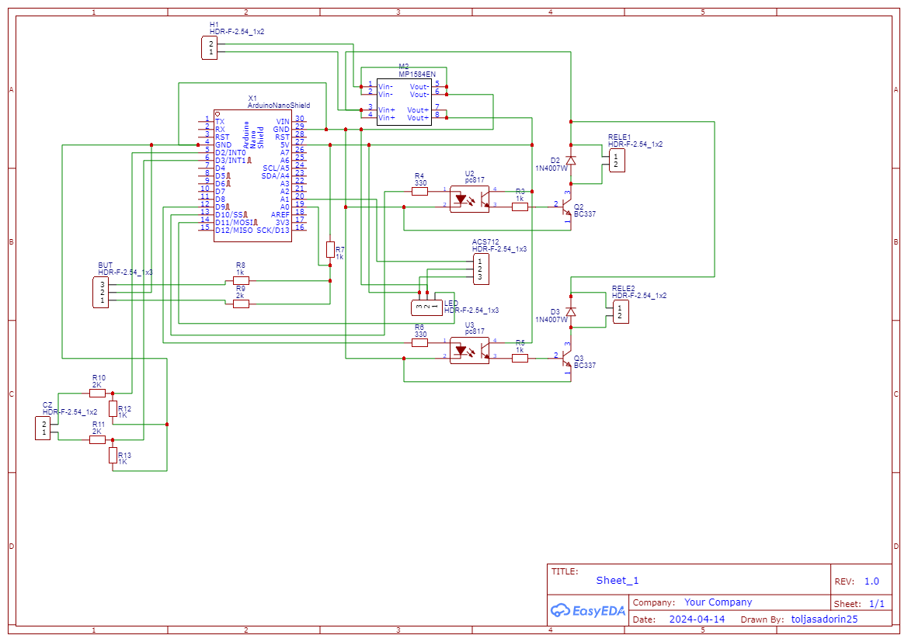
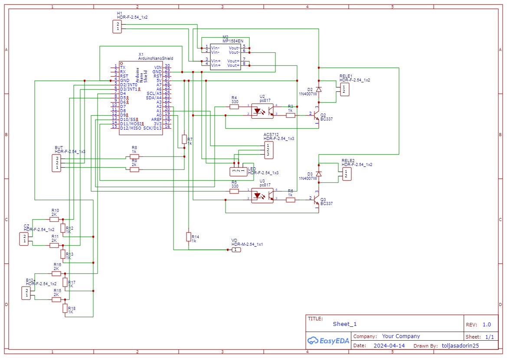

<b>Управление стеклоподъемниками авто</b>
<h2>Схема подключения для водительской двери</h2>

<table>
    <tr>
        <th>Пин Arduino</th>
        <th>Описание</th>
        <th>Пин Arduino</th>
        <th>Описание</th>
    </tr>
    <tr>
        <td>D2</td>
        <td>оптопара стекло 2верх</td>
        <td>A0</td>
        <td>кнопка 1 / блокировка</td>
    </tr>
    <tr>
        <td>D3</td>
        <td>оптопара стекло 2вниз</td>
        <td>A1</td>
        <td>кнопка 2</td>
    </tr>
    <tr>
        <td>D4</td>
        <td>оптопара стекло 3верх</td>
        <td>A2</td>
        <td>кнопка 3</td>
    </tr>
    <tr>
        <td>D5</td>
        <td>оптопара стекло 3вниз</td>
        <td>A3</td>
        <td>кнопка 4</td>
    </tr>
    <tr>
        <td>D6</td>
        <td>оптопара стекло 4верх</td>
        <td>A4</td>
        <td>датчик тока</td>
    </tr>
    <tr>
        <td>D7</td>
        <td>оптопара стекло 4вниз</td>
        <td>A5</td>
        <td>сигнал двери 1</td>
    </tr>
    <tr>
        <td>D8</td>
        <td>возврат в положение</td>
        <td>A6</td>
        <td>сигнал двери 2</td>
    </tr>
    <tr>
        <td>D9</td>
        <td>реле1</td>
        <td>A7</td>
        <td>сигнал двери 3</td>
    </tr>
    <tr>
        <td>D10</td>
        <td>реле2</td>
        <td></td>
        <td></td>
    </tr>
    <tr>
        <td>D11</td>
        <td>шим подсветка</td>
        <td></td>
        <td></td>
    </tr>
    <tr>
        <td>D12</td>
        <td>сигнал с цз</td>
        <td></td>
        <td></td>
    </tr>
</table>	
 
<h2>Схема подключения для обычной двери</h2>
<table>
    <tr>
        <th>Пин Arduino</th>
        <th>Описание</th>
        <th>Пин Arduino</th>
        <th>Описание</th>
    </tr>
    <tr>
        <td>D2</td>
        <td></td>
        <td>A0</td>
        <td>кнопка верх/вниз</td>
    </tr>
    <tr>
        <td>D3</td>
        <td></td>
        <td>A1</td>
        <td>сигнал с вод двери</td>
    </tr>
    <tr>
        <td>D4</td>
        <td></td>
        <td>A2</td>
        <td>датчик тока</td>
    </tr>
    <tr>
        <td>D5</td>
        <td></td>
        <td>A3</td>
        <td></td>
    </tr>
    <tr>
        <td>D6</td>
        <td></td>
        <td>A4</td>
        <td></td>
    </tr>
    <tr>
        <td>D7</td>
        <td>сигнал о закрытии</td>
        <td>A5</td>
        <td></td>
    </tr>
    <tr>
        <td>D8</td>
        <td></td>
        <td>A6</td>
        <td></td>
    </tr>
    <tr>
        <td>D9</td>
        <td>реле1</td>
        <td>A7</td>
        <td></td>
    </tr>
    <tr>
        <td>D10</td>
        <td>реле2</td>
        <td></td>
        <td></td>
    </tr>
    <tr>
        <td>D11</td>
        <td>шим подсветка</td>
        <td></td>
        <td></td>
    </tr>
    <tr>
        <td>D12</td>
        <td>сигнал с цз</td>
        <td></td>
        <td></td>
    </tr>
</table>

<b>Схема включения автомобильного реле через транзистор bc337-40</b>
  

 

<b>Распиновка транзистора bc337</b>
  

 

<b>Схема прототипа (вариант 1)</b>
  

 

<b>Схема прототипа (вариант 2)</b>
  

<b>Схема прототипа (вариант 3)</b>
   
<i>Добавлено</i>
<i>Место для резистивной кнопки управления</i>
<i>Резистивные делители для сигналов +12В (для применения с обычной схемой стеклоподъемников)</i>

